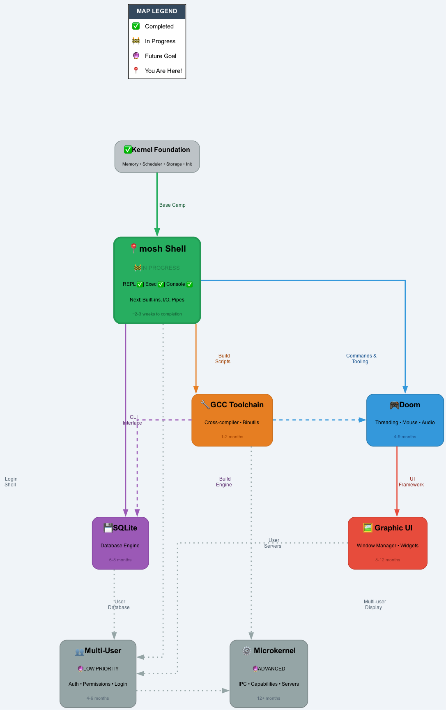

# meniOS Roadmap Collection

Welcome to the meniOS roadmap! This directory contains detailed roadmaps for major features and milestones.

## 🗺️ Visual Roadmap



**Legend:**
- ✅ **Completed** - Feature is implemented and working
- 🚧 **In Progress** - Active development
- 🔮 **Future Goal** - Planned for later
- 📍 **You Are Here!** - Current focus area

## 📍 Current Location: mosh Shell

**Status:** 🚧 In Progress (2-3 weeks to completion)

**Completed:**
- ✅ REPL (Read-Eval-Print Loop)
- ✅ Command execution (fork/exec/wait)
- ✅ Console bridge with TTY

**Next Steps:**
- Built-in commands (cd, pwd, exit, export)
- I/O redirection (>, <, >>)
- Pipe support (|)

## 🛣️ Available Roads

### Near-Term Goals (0-3 months)

#### [🐚 Road to Shell](road_to_shell.md)
**Current Focus** | 2-3 weeks remaining
- Build a fully-featured command-line shell called **mosh**
- Interactive command execution, pipes, built-ins
- Terminal integration with VGA and TTY

#### [🔧 Road to GCC Toolchain](road_to_gcc.md)
**High Priority** | 1-2 months
- Cross-compiler targeting meniOS
- Build native applications
- Foundation for all userland development

### Mid-Term Goals (3-9 months)

#### [🎮 Road to Doom](road_to_doom.md)
**Flagship Goal** | 4-9 months
- Run the classic 1993 Doom game
- Threading, mouse input, audio subsystem
- Demonstrates OS capability and maturity

#### [💾 Road to SQLite](road_to_sqlite.md)
**Database Support** | 6-8 months
- Port SQLite database engine
- Enable data persistence for applications
- Requires working filesystem and toolchain

#### [🖼️ Road to Graphic Interface](road_to_graphic_interface.md)
**GUI Framework** | 8-12 months
- Window manager and widget toolkit
- Enable graphical applications
- Builds on Doom's graphics foundation

### Long-Term Goals (6+ months)

#### [👥 Road to Multi-User](road_to_multiuser.md)
**Low Priority** | 4-6 months when started
- User authentication and permissions
- Process isolation and security
- Login shells and home directories
- **Note:** Not needed for single-user development use case

#### [⚙️ Road to Microkernel](road_to_microkernel.md)
**Advanced Architecture** | 12+ months
- Message-passing IPC
- Capability-based security
- User-space servers
- **Note:** Advanced research goal

## 🏛️ Foundation (Complete!)

All prerequisite infrastructure is in place:
- ✅ Memory management (kmalloc, VM manager, mmap/munmap)
- ✅ Process management (fork/exec, wait/waitpid, zombies)
- ✅ Scheduling (preemptive scheduler, kernel threads)
- ✅ Storage stack (AHCI, block cache, FAT32/ext2, VFS)
- ✅ File descriptors and I/O syscalls
- ✅ Init program (PID 1) with boot integration
- ✅ Virtual filesystems (tmpfs, devfs, procfs)
- ✅ Signal delivery primitives
- ✅ Framebuffer graphics
- ✅ Keyboard input

## 🎯 Dependencies Between Roads

```
Foundation ──────┐
                 ↓
            mosh Shell ──────┬──→ Doom (commands & tooling)
                 ↓           ├──→ SQLite (CLI interface)
                 ↓           └──→ Multi-User (login shell)
                 ↓
          GCC Toolchain ─────┬──→ Doom (compile port)
                             ├──→ SQLite (build engine)
                             └──→ Microkernel (user servers)

          Doom ──────────────┬──→ Graphic UI (drawing APIs)
                             └──→ SQLite (save data)

          Multi-User ────────┬──→ Microkernel (security model)
                             └──→ SQLite (user database)
```

## 📋 Road Document Format

Each road document contains:
1. **Current Status** - Where we are now
2. **Requirements** - What's needed
3. **Implementation Roadmap** - Phased approach
4. **Dependencies** - What must be done first
5. **Timeline Estimates** - How long it will take
6. **Success Criteria** - How we know we're done

## 🚀 Getting Started

1. **Check your location**: You are at 📍 **mosh Shell**
2. **Review the current road**: See [road_to_shell.md](road_to_shell.md)
3. **Check dependencies**: Most prerequisites are complete!
4. **Start building**: Follow the roadmap phases

## 📊 Overall Progress

**Foundation:** ████████████████████ 100% ✅
**Shell:**      ████████████░░░░░░░░ 60% 🚧
**Doom:**       ████░░░░░░░░░░░░░░░░ 20% 🔮
**GCC:**        ██░░░░░░░░░░░░░░░░░░ 10% 🔮
**SQLite:**     ░░░░░░░░░░░░░░░░░░░░  0% 🔮
**GUI:**        ░░░░░░░░░░░░░░░░░░░░  0% 🔮
**Multi-User:** ░░░░░░░░░░░░░░░░░░░░  0% 🔮
**Microkernel:** ░░░░░░░░░░░░░░░░░░░░  0% 🔮

---

*Last Updated: 2025-09-30*
*Current Focus: mosh Shell - Built-ins, I/O, and Pipes*
*Next Milestone: Working shell with pipes in ~2 weeks*